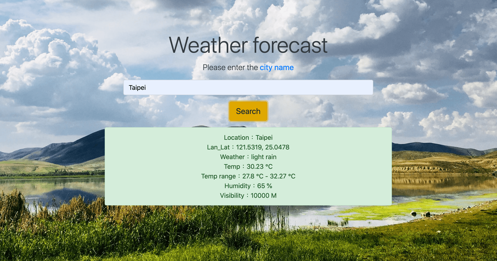

## Exercise - Use PHP and jQuery to connect weather API to make a weather forecast webpage.

> Use PHP and jQuery to link weather API data and get current weather conditions by entering a country or city.

- **Weather Forecast**:
